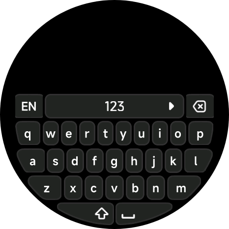
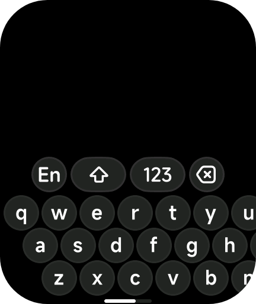

<div align="center">

# Vela Multilingual Keyboard

**A drop-in on-screen keyboard for Vela JS quick apps.**
Six languages, round and rectangular screens, one component.


<table>
  <tr>
    <td align="center"></td>
    <td align="center"></td>
  </tr>
  <tr>
    <td align="center"><sub>Round: Xiaomi Watch S4</sub></td>
    <td align="center"><sub>Rectangular: Redmi Watch</sub></td>
  </tr>
</table>

</div>

---

## Overview

This is a modified version of the native Vela input method component from [NEORUAA/Vela_input_method](https://github.com/NEORUAA/Vela_input_method), extended to type in **English, Arabic, Russian, Spanish, French and German**. It was built for the Xiaomi Watch S4 (round) and also runs on rectangular screens such as the Redmi Watch. Pill-shaped screens (such as the Xiaomi Band) use the rectangular layout but are not fully supported yet; see [Known issues](#known-issues).

The original artwork and geometry are kept. The difference is that key letters are drawn in code instead of being baked into the images, so any layout can reuse the same key shapes.

**Modified by Aser.**

## Features

| | |
| --- | --- |
| **6 layouts** | English, Arabic, Russian, Spanish, French, German |
| **Language picker** | Built into the toolbar; the choice is remembered between launches |
| **Round and rect screens** | Detected automatically. Works on Xiaomi Watch S4 (round) and Redmi Watch (rect); pill-shaped is partial |
| **Script-aware shift** | Shift for cased scripts; disabled for Arabic, which uses its own comma `،` |
| **Symbols layer** | Digits and punctuation, plus extras like `é è ç à ù` (French) and `¿ ¡` (Spanish) |
| **Self-contained** | No i18n module or helper files required |
| **Event-based** | You own the text; the keyboard only reports what was typed |

## Quick start

### 1. Get the code

Clone the repository:

```bash
git clone https://github.com/Aser-Mohamed/vela-multilingual-keyboard.git
cd vela-multilingual-keyboard
```

No Git? Use **Code > Download ZIP** on the [repository page](https://github.com/Aser-Mohamed/vela-multilingual-keyboard) and unzip it.

The part you need is the `components/` folder. Everything else is documentation and an example.

### 2. Copy it into your app

Copy the `components/` folder into your app's `src/` folder.

```
src/
├── components/
│   ├── Keyboard.ux
│   └── keyboard-assets/      <- must stay next to Keyboard.ux
└── pages/
    └── index/
        └── index.ux
```

> `Keyboard.ux` loads its images from `./keyboard-assets/`, so keep the two together.

### 3. Declare the features it uses

In `manifest.json`:

```json
"features": [
  { "name": "system.storage" },
  { "name": "system.device" }
]
```

### 4. Use it in a page

```html
<import name="custom-keyboard" src="../../components/Keyboard.ux"></import>

<template>
  <stack class="page">
    <text class="out">{{ text }}</text>

    <custom-keyboard
      is-visible="{{ true }}"
      @keypress="onKeyPress"
      @delete="onDelete"
      @close="onClose"
    ></custom-keyboard>
  </stack>
</template>

<style>
.page { width: 100%; height: 100%; background-color: #000000; }
.out  { color: #ffffff; font-size: 28px; text-align: center; }
</style>

<script>
import router from "@system.router"

export default {
  private: { text: "" },

  onKeyPress(e) { this.text += e.detail.value },
  onDelete()    { this.text = this.text.slice(0, -1) },
  onClose()     { router.back() }
}
</script>
```

That is a working keyboard. A fuller page that also positions a text bar above the keyboard is in [`examples/basic`](examples/basic/index.ux).

## API at a glance

**Props**

| Prop | Type | Default | Description |
| --- | --- | --- | --- |
| `is-visible` | boolean | `false` | Show or hide the keyboard |
| `cancel-label` | string | `"Cancel"` | Text of the Cancel button in the language picker |

**Events**

| Event | Payload | Fired when |
| --- | --- | --- |
| `keypress` | `{ detail: { value } }` | A character or the space bar is pressed |
| `delete` | none | Delete is pressed |
| `heightchange` | `{ detail: { value } }` | The keyboard's height (px) is known or changes |
| `close` | none | The dismiss chevron is pressed |

Full reference: [docs/api.md](docs/api.md)

## Add features

### Add or change a language

Everything lives at the top of the `<script>` block in `Keyboard.ux`. To add Italian:

```js
// 1. Add the letter rows (exactly three rows) to LAYOUTS
IT: [
  ["q","w","e","r","t","y","u","i","o","p"],
  ["a","s","d","f","g","h","j","k","l"],
  ["z","x","c","v","b","n","m"]
],
```

```js
// 2. Add the code to langCodes (this is also the picker order)
langCodes: ["EN", "AR", "ES", "DE", "RU", "FR", "IT"],
```

Optionally add extra symbols in `SYM_ROW3`, or list a script without letter case in `CASELESS`. Nothing else needs to change. See [docs/languages.md](docs/languages.md).

### Translate the Cancel button

```html
<custom-keyboard cancel-label="إلغاء" ...></custom-keyboard>
```

### Place a text bar above the keyboard

The keyboard reports its height, so a preview bar can sit directly on top of it:

```html
<div style="position: absolute; left: 0; width: 100%; bottom: {{ barBottom }}px;">
  <text>{{ text }}</text>
</div>
```

```js
onKeyboardHeight(e) {
  const h = e && e.detail ? e.detail.value : 0
  if (h) this.barBottom = h + 8
}
```

### Show and hide it

Bind `is-visible` to a variable and flip it. Hiding also closes an open language picker.

## Documentation

| Guide | What is in it |
| --- | --- |
| [Getting started](docs/getting-started.md) | Step-by-step setup and your first page |
| [API reference](docs/api.md) | Props, events, storage |
| [Languages and layouts](docs/languages.md) | Every layout, and how to add or edit one |
| [Screens and sizing](docs/screens.md) | Round vs rectangular, scaling, the height event |
| [Troubleshooting](docs/troubleshooting.md) | Common problems and fixes |

## Known issues

- **Pill-shaped screens (Xiaomi Band):** the keyboard loads the rectangular layout, but the toolbar does not fit. In testing the shift and `123` keys show while the language and delete keys are not visible, so language switching and delete are unreachable there. See [Screens and sizing](docs/screens.md#pill-shaped-screens).

## Project structure

```
vela-multilingual-keyboard/
├── components/
│   ├── Keyboard.ux          the component
│   └── keyboard-assets/     key and toolbar artwork
├── docs/                    guides
├── examples/basic/          runnable example page
├── LICENSE
└── README.md
```

## Credits

Based on [NEORUAA/Vela_input_method](https://github.com/NEORUAA/Vela_input_method), used under the MIT license. Multilingual layouts, language picker and the modifications are by Aser.

## License

[MIT](LICENSE). The upstream copyright notice is kept, as the license requires.
