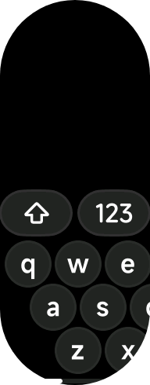

# Screens and sizing

The keyboard detects the screen by itself. You do not need to pass a screen type or write any detection code.

## How it decides

On start it calls `device.getInfo()` and reads `screenShape`:

| `screenShape` | Layout | Height |
| --- | --- | --- |
| `rect` | Rectangular | fixed 255 px |
| `pill-shaped` | Rectangular layout (partial support) | fixed 255 px |
| anything else, or lookup fails | Round | `321 × screenWidth / 480` px |

## Round screens

Based on the native Vela IME's 480 × 321 round keyboard, scaled to the device. Each row is as wide as the circle allows at that height, so keys never fall outside the glass. Controls also stay inside a 32 px safe area on the left, because the Xiaomi Watch S4 reserves that edge for the system back gesture.

## Rectangular screens

Ported from the native rect board: 60 px keys on a 64 px pitch, with rows indented 0 / 32 / 64 px inside a horizontal scroll area. A small indicator shows the scroll position.


## Pill-shaped screens

Pill-shaped screens (for example the Xiaomi Band) are sent to the same rectangular board, as the upstream component does. This is **not fully working yet**:



- The shift and `123` keys are visible, but the language and delete keys are not.
- Without the language key you cannot switch layouts, and without delete you cannot remove characters.
- The letter rows scroll horizontally, so some keys sit off-screen until scrolled.

The rectangular toolbar was laid out for wider screens than a band. Fixing this means giving pill screens their own toolbar width. Contributions are welcome.

## Laying out the rest of your page

Use `heightchange` to place things above the keyboard:

```js
onKeyboardHeight(e) {
  const h = e && e.detail ? e.detail.value : 0
  if (h) this.barBottom = h + 8
}
```

### Bars on round screens

The usable width of a circle shrinks toward the top and bottom edges. A full-width bar just above the keyboard can be clipped by the bezel. To avoid that, size the bar from the circle's chord at the y-band the bar occupies, and use the same shape test as the keyboard: `rect` and `pill-shaped` are flat, anything else is round.

Expressing that width as a percentage of the screen width keeps it independent of how your project interprets `designWidth`.

## Design width

The round layout scales by `screenWidth / 480`. It has been used with `designWidth` set to `"device-width"` on a 466 px round screen (Xiaomi Watch S4). Vela's docs describe `designWidth` as an integer defaulting to 480 and do not document `"device-width"`. If everything renders at twice the expected size, check this setting first.
